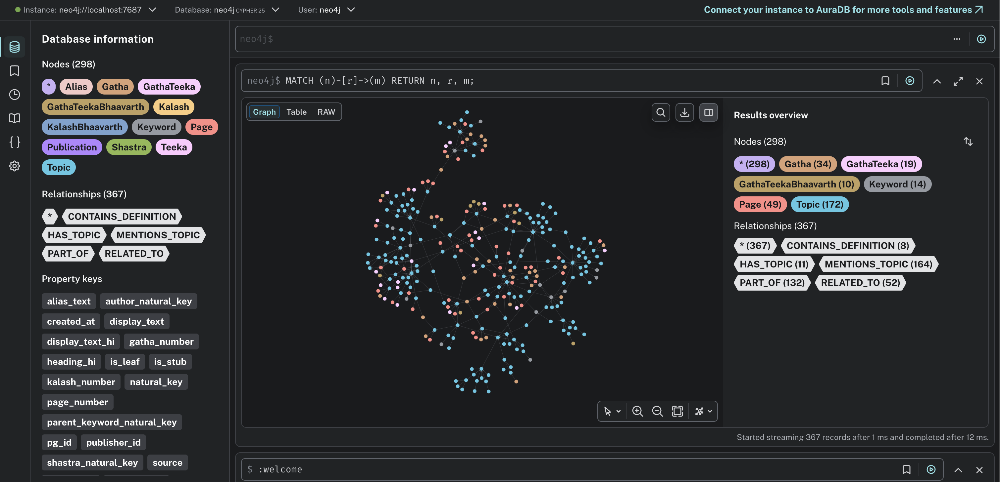
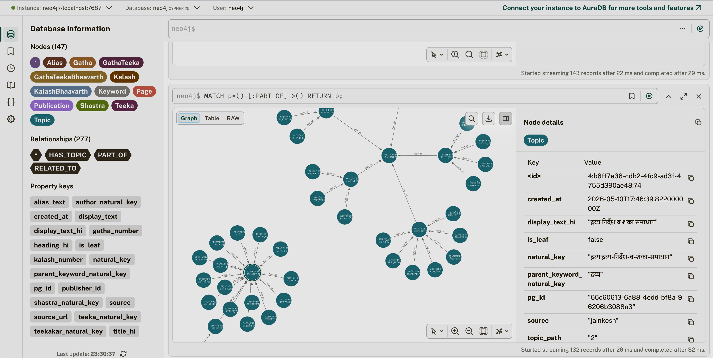

# Jain Dictionary & Knowledge Base Service

A structured, knowledge-graph-backed retrieval layer for Jain texts. Complements `cataloguesearch` (vector/BM25) and `cataloguesearch-chat` (LLM chat). Uses GraphRAG.

## Usecases/Objectives

- **Structured (knowledge retented) search engine** for Jain Texts expanded/enhanced on top of `JainKosh` authored by - _Kshullak Jinendra Varni Ji_ and the works done by scholars for creating its digital infrastructure at [jainkosh.org](www.jainkosh.org) by linking keywords with definitions/topics/shastras/references. Also, uses various shastras' OCRed data fed systematically and categorically.

- **Graph traversal** of Jain Knowledge Base in an interactive UI.

<p float="left">
  
  
</p>

- **Finding exact** sanskrit/prakrit/hindi gatha from shastras and understanding it word to word.

- Acts as a **cache and pre-querying dictionary** layer (finding exact keywords) to the existing vector search at cataloguesearch.

- **In depth answer generation** of questions on cataloguesearch-chat

- Structured or metadata based questions (like questions related on a specific gatha, adhyaya, specific topic mentions, translations of gatha verses etc.) For ex -
  - समयसार की गाथा ६ बताओ
  - समयसार की गाथा ६ की संस्कृत समझाओ
  - षट् द्रव्य के क्रियावान् व भाववान् विभाग का वर्णन कोन कोनसे शास्त्रों में आया है?

[Current vector search only extracts excerpts of gatha mentions in texts but does not have context of the gatha itself, what does it explain at an high level etc. This will extract high-level content and specific topics which are relevant to it, feed it to chat service, and then final answer generation will utilize both vectored RAG and vectorless/graphRAG results.]

- **Train a Jainism based AI model** in future with the help of Cataloguesearch OCRed data and this Knowledge Graph for the most accurate results.

## What this service does

- **Master Metadata** — authors, shastras, teekas, books, pravachans, anuyogas stored in PostgreSQL with stable UUIDs.
- **Dictionary** — gathas (Prakrit/Sanskrit/Hindi), keyword definitions, keyword↔topic mappings stored in MongoDB (long-form text) with index rows in PostgreSQL.
- **Knowledge Graph** — keyword↔topic↔topic relations in Neo4j, enabling GraphRAG retrieval.
- **Ingestion pipeline** — scrapers for JainKosh and nikkyjain.github.io; an enrichment loop that pulls topic candidates from `cataloguesearch-chat`.
- **Admin + Public APIs** — FastAPI services for curating content and serving the public UI.

## Architecture

Four separate FastAPI services sharing `jain_kb_common`:

| Service | Port | Role |
|---|---|---|
| `metadata-service` | 8001 | CRUD on authors / shastras / teekas / publications / books / pravachans |
| `data-service` | 8002 | Read API for gathas, keywords, topics, kalashas; browse and cross-entity search |
| `navigation-service` | 8003 | Neo4j graph navigation: alias resolution, topic neighbors, keyword↔topic links; alias and edge admin |
| `query-service` | 8004 | GraphRAG endpoint for `cataloguesearch-chat`: tokenize → resolve → graph-traverse → rank |

Data stores: **PostgreSQL 16** (source of truth for IDs) · **MongoDB 7** (long-form text) · **Neo4j 5** (graph) · **Redis 7** (Celery broker).

See [`docs/design/00_overview.md`](docs/design/00_overview.md) for the full architecture diagram and reading order.

---

## Implementation status

### ✅ Completed: Postgres data model (`docs/design/02_data_model_postgres.md`)

**Package**: `packages/jain_kb_common` — shared Python library installed as `jain-kb-common`.

#### SQLAlchemy models (`jain_kb_common/db/postgres/`)

| File | Models |
|---|---|
| `authors.py` | `Author` |
| `shastras.py` | `Shastra`, `ShastrasAnuyoga` |
| `anuyogas.py` | `Anuyoga` |
| `teekas.py` | `Teeka` |
| `books.py` | `Book`, `BookAnuyoga` |
| `pravachans.py` | `Pravachan` |
| `keywords.py` | `Keyword`, `KeywordAlias` |
| `gathas.py` | `Gatha` |
| `topics.py` | `Topic` |
| `ingestion.py` | `ParserConfig`, `IngestionRun`, `IngestionReviewQueue` |
| `enrichment.py` | `TopicCandidate`, `ChatPullerState` |
| `query_logs.py` | `QueryLog` |

All models use SQLAlchemy 2 `Mapped`/`mapped_column` style with `JSONB` and `UUID(as_uuid=True)`. Enums are declared in `enums.py` as Python `str, enum.Enum` with matching `SAEnum` instances.

#### Alembic migrations (`migrations/versions/`)

| Migration | Contents |
|---|---|
| `0001_setup.py` | Extensions (pgcrypto, pg_trgm, btree_gin), enums, `set_updated_at()` trigger |
| `0002_seed_anuyogas.py` | Four anuyoga rows with Hindi + English multilingual labels |
| `0003_authors_shastras.py` | `authors`, `shastras`, `anuyogas`, `shastra_anuyogas` |
| `0004_teekas_books_pravachans.py` | `teekas`, `books`, `book_anuyogas`, `pravachans` |
| `0005_keywords_aliases.py` | `keywords`, `keyword_aliases` (GIN + trgm indexes) |
| `0006_gathas_topics_mentions.py` | `gathas`, `topics`, `topic_mentions` (GIN jsonb_path_ops indexes, CHECK constraint) |
| `0007_ingestion_ops.py` | `parser_configs`, `ingestion_runs`, `ingestion_review_queue` |
| `0008_chat_enrichment.py` | `topic_candidates`, `chat_puller_state` |
| `0009_query_logs.py` | `query_logs` |
| `0010_topics_hierarchy.py` | `topic_path`, `parent_topic_id`, `is_leaf`, `is_synthetic` columns + CHECK constraint on `topics` |
| `0011_publications.py` | `publications` table + `idx_publications_teeka` |
| `0012_kalashas.py` | `kalashas` table + `idx_kalashas_teeka` |

#### Upsert helpers (`jain_kb_common/db/postgres/upserts.py`)

`upsert_author`, `upsert_shastra`, `upsert_teeka`, `upsert_book`, `upsert_pravachan`, `upsert_keyword`, `upsert_topic`, `upsert_gatha`, `upsert_publication`, `upsert_kalash` — all idempotent via `ON CONFLICT (natural_key) DO UPDATE`.

#### Tests

```bash
# Run (requires PostgreSQL running locally)
DATABASE_URL="postgresql+asyncpg://$(whoami)@localhost/jain_kb_test" \
  .venv/bin/python -m pytest tests/ -v

# Without DATABASE_URL: 8 tests skip gracefully
.venv/bin/python -m pytest tests/ -v
```

See [`dev_docs/testing.md`](docs/manual_testing/postgres/testing.md) for the full manual testing guide.

---

### ✅ Completed: MongoDB data model (`docs/design/03_data_model_mongo.md`)

**Package**: `packages/jain_kb_common` — `jain_kb_common/db/mongo/`.

#### Layout

| File | Purpose |
|---|---|
| `__init__.py` | `get_mongo_client(url)` / `get_db(url, db_name)` factory (singleton `AsyncIOMotorClient`) |
| `collections.py` | Collection-name string constants (`GATHA_PRAKRIT`, `KEYWORD_DEFINITIONS`, …) |
| `schemas.py` | Pydantic v2 document models; `LangText.text` auto-NFC-normalizes on construction |
| `upserts.py` | `stable_id(natural_key)` + `upsert_*` helpers (one per collection) |
| `indexes.py` | `ensure_indexes(db)` — creates all indexes idempotently; call on service startup |

#### Collections implemented

| Collection | Pydantic model | Upsert helper |
|---|---|---|
| `gatha_prakrit` | `GathaPrakrit` | `upsert_gatha_prakrit` |
| `gatha_sanskrit` | `GathaSanskrit` | `upsert_gatha_sanskrit` |
| `gatha_hindi_chhand` | `GathaHindiChhand` | `upsert_gatha_hindi_chhand` |
| `gatha_word_meanings` | `GathaWordMeanings` | `upsert_gatha_word_meanings` |
| `teeka_gatha_mapping` | `TeekaGathaMapping` | `upsert_teeka_gatha_mapping` |
| `keyword_definitions` | `KeywordDefinition` | `upsert_keyword_definition` |
| `topic_extracts` | `TopicExtract` | `upsert_topic_extract` |
| `raw_html_snapshots` | `RawHtmlSnapshot` | `upsert_raw_html_snapshot` |
| `ocr_pages` | `OcrPage` | _(scaffolded — indexes only, no upsert yet)_ |
| `gatha_teeka_sanskrit` | `GathaTeekaSanskrit` | `upsert_gatha_teeka_sanskrit` |
| `gatha_teeka_hindi` | `GathaTeekkaHindi` | `upsert_gatha_teeka_hindi` |
| `gatha_teeka_bhaavarth_hindi` | `GathaTeekaBhaavarth` | `upsert_gatha_teeka_bhaavarth_hindi` |
| `kalash_sanskrit` | `KalashSanskrit` | `upsert_kalash_sanskrit` |
| `kalash_hindi` | `KalashHindi` | `upsert_kalash_hindi` |
| `kalash_bhaavarth_hindi` | `KalashBhaavarth` | `upsert_kalash_bhaavarth_hindi` |

#### Key conventions

- **`stable_id(natural_key)`** — SHA-1 of the UTF-8 key, first 12 bytes → `ObjectId`. Same key always produces the same `_id`, so Postgres references survive re-scrapes.
- **`$setOnInsert: {created_at}`** — `created_at` is only written on the first insert; subsequent upserts leave it untouched while updating `updated_at`.
- **NFC normalization** — `LangText.text` field validator calls `unicodedata.normalize('NFC', v)` on every construction.
- **`ensure_indexes(db)`** is safe to call on every startup (Motor's `create_index` is idempotent). `topic_extracts` has a full-text index with `default_language: "none"` for Devanagari. `raw_html_snapshots` has a TTL index (365 days) on `fetched_at`.

#### Tests

```bash
# Offline (no DB required) — schema + stable_id tests
.venv/bin/python -m pytest tests/db/mongo/ -v

# With MongoDB running
MONGO_URL="mongodb://localhost:27017" \
  .venv/bin/python -m pytest tests/db/mongo/ -v
```

Without `MONGO_URL`, 8 round-trip tests skip gracefully; 6 offline tests always run.

See [`docs/manual_testing/mongo/testing.md`](docs/manual_testing/mongo/testing.md) for the full manual testing guide.

---

### ✅ Completed: Neo4j graph data model (`docs/design/04_data_model_graph.md`)

**Package**: `packages/jain_kb_common` — `jain_kb_common/db/neo4j/`.

#### Layout

| File | Purpose |
|---|---|
| `__init__.py` | `get_driver(url, user, password)` / `close_driver()` singleton factory (`AsyncGraphDatabase`) |
| `constraints.py` | `ensure_constraints(driver, database)` — creates 5 uniqueness constraints + 2 indexes; idempotent via `IF NOT EXISTS` |
| `upserts.py` | `sync_keyword`, `sync_topic`, `sync_shastra`, `sync_gatha` — idempotent MERGE-based upserts |
| `queries.py` | `resolve_token`, `traverse_topics`, `shortest_path` |
| `schema_check.py` | `validate_edge_type(name)` — rejects unknown edge types; reads `parser_configs/_meta/edge_types.yaml` |

#### Node labels implemented

**Postgres-backed**: `Keyword` · `Topic` · `Alias` · `Gatha` · `Shastra` · `Teeka` · `Publication` · `Kalash`

**Graph-only (lazy MERGE)**: `GathaTeeka` · `GathaTeekaBhaavarth` · `KalashBhaavarth` · `Page`

#### Edge types (`parser_configs/_meta/edge_types.yaml`)

`IS_A` · `PART_OF` · `RELATED_TO` · `ALIAS_OF` · `MENTIONS_KEYWORD` · `HAS_TOPIC` · `MENTIONS_TOPIC` · `CONTAINS_DEFINITION` · `IN_SHASTRA` · `IN_TEEKA` · `IN_PUBLICATION`

#### Key conventions

- **Cypher 25 compatible** — uses `coalesce(n.created_at, datetime())` instead of `ON CREATE SET` (Neo4j 2026 ships with `db.query.default_language=CYPHER_25`).
- **Idempotent MERGE** — every upsert uses `MERGE` with full `SET`; safe to re-run on the same data.
- **`ensure_constraints()`** — all constraints and indexes use `IF NOT EXISTS`; safe to call on every service startup. Covers 7 uniqueness constraints + 3 `pg_id` lookup indexes for Postgres-backed node labels.
- **Edge type validation** — `validate_edge_type(edge_type)` raises `UnknownEdgeTypeError` for any edge type not in `edge_types.yaml`. Add new types there; no code changes needed.
- **Driver factory** — `get_driver()` reads `NEO4J_URL`, `NEO4J_USER`, `NEO4J_PASSWORD` from environment; singleton pattern matches Motor/SQLAlchemy conventions.
- **Lazy-node pattern** — `ensure_lazy_node` creates pure-graph nodes (`GathaTeeka`, `GathaTeekaBhaavarth`, `KalashBhaavarth`, `Page`) + their structural edge in one MERGE round trip; called by the envelope layer before emitting reference edges.
- **Structural edges excluded from traversal** — `IN_SHASTRA`, `IN_TEEKA`, `IN_PUBLICATION` carry `weight = 0.0` and are excluded from Stage 4 query patterns to prevent backbone noise in ranking.

#### Tests

```bash
# Neo4j tests only (requires Neo4j running)
export NEO4J_URL="bolt://localhost:7687"
export NEO4J_USER="neo4j"
export NEO4J_PASSWORD="jainkb_password"
python -m pytest tests/db/neo4j/ -v

# All tests (all three env vars set, 41 tests, 0 skipped)
export DATABASE_URL="postgresql+asyncpg://$(whoami)@localhost/jain_kb_test"
export MONGO_URL="mongodb://localhost:27017"
export NEO4J_URL="bolt://localhost:7687"
export NEO4J_USER="neo4j"
export NEO4J_PASSWORD="jainkb_password"
python -m pytest tests/ -v
```

See [`docs/manual_testing/neo4j/testing.md`](docs/manual_testing/neo4j/testing.md) for the full manual testing guide.

---

### ✅ Completed: JainKosh HTML Parser — parser-only stage (`docs/design/08_ingestion_jainkosh.md`)

**Package**: `workers/ingestion/jainkosh/` — pure HTML→JSON parser, no DB writes. Currently at **v1.2.0** (fix-spec-001 and fix-spec-002 applied; see `docs/design/jainkosh/parser_fix_spec_002/README.md`).

#### What it does

Reads pre-saved HTML from `samples/sample_html_jainkosh_pages/` and produces a `WouldWriteEnvelope` JSON showing exactly what each store (Postgres / Mongo / Neo4j) would receive on approval.

#### Modules

| File | Purpose |
|---|---|
| `config.py` | Pydantic models for `parser_configs/jainkosh.yaml` + YAML loader with JSON Schema validation |
| `models.py` | All Pydantic output types: `Block`, `Definition`, `Subsection`, `IndexRelation`, `PageSection`, `KeywordParseResult`, `WouldWriteEnvelope` |
| `normalize.py` | NFC, ZWJ/ZWNJ strip, whitespace collapse, URL decode |
| `topic_keys.py` | Devanagari-aware slugging, `natural_key()`, `parent_of()` |
| `selectors.py` | CSS class → block kind mapping |
| `parse_keyword.py` | Top-level entry: `parse_keyword_html(html, url, config)` |
| `parse_section.py` | Splits one h2-section into pre_heading / index_ols / body / tables |
| `parse_index.py` | Leading `<ol>/<ul>` index → `IndexRelation` list |
| `parse_subsections.py` | Heading detection (V1–V4) + subsection tree assembly via full DFS |
| `parse_blocks.py` | Block stream with translation marker absorption and nested-span flatten |
| `parse_definitions.py` | `siddhantkosh` (GRef-boundary) and `puraankosh` (p[id]) definitions |
| `refs.py` | GRef extraction (leading vs trailing); `strip_refs_from_text` (ref-strip pass) |
| `see_also.py` | Configurable-trigger देखें detection (inline + index); redlink prose-strip |
| `nav.py` | पूर्व पृष्ठ / अगला पृष्ठ detection and removal |
| `tables.py` | Table → `Block(kind="table", raw_html=…)`; `extraction_strategy` switch |
| `envelope.py` | Builds the `would_write` dict (Postgres rows, Mongo docs, Neo4j nodes/edges) |
| `cli.py` | `python -m workers.ingestion.jainkosh.cli parse <html> --out <json>` |

#### Parse results (sample pages, v1.6.0)

| Page | SK defs | PK defs | Index relations | Total subsections | Keywords | Topics | Nodes | Edges | Warnings |
|------|---------|---------|-----------------|-------------------|----------|--------|-------|-------|---------|
| आत्मा | 4 | 2 | 0 | 7 | 1 | 7 | 8 | 10 | 0 |
| द्रव्य | 1 | 1 | 26 | 59 | 1 | 85 | 86 | 121 | 0 |
| पर्याय | 1 | 2 | 8 | 43 | 1 | 51 | 52 | 59 | 0 |

To regenerate this table from the latest goldens: `python workers/ingestion/jainkosh/golden_stats.py`

#### Tests

```bash
# No DB required — pure Python parser
pip install selectolax PyYAML jsonschema pydantic
python -m pytest workers/ingestion/jainkosh/tests/ -v
```

See [`docs/manual_testing/jainkosh_parser.md`](docs/manual_testing/jainkosh_parser.md) for the full manual testing guide.

---

### ✅ Completed: Phase 1 — Schema deltas + apply-on-approve layer (`docs/design/ingestion/phase_1_schema_and_apply.md`)

**Package / module**: `workers/ingestion/jainkosh/apply.py`

#### What was added

| Area | Change |
|---|---|
| `topics.py` | 4 new columns: `topic_path`, `parent_topic_id`, `is_leaf`, `is_synthetic` + new indexes + CHECK constraint |
| `keywords.py` | `KeywordAlias` unique constraint fixed to `(keyword_id, alias_text)` |
| `upserts.py` | `upsert_topic` extended with 4 new kwargs; new `upsert_keyword_alias` helper |
| `mongo/schemas.py` | New types: `DefinitionItem`, `SubsectionTreeNode`, `IndexRelationItem`, `KeywordPageSection`; `KeywordDefinition` and `TopicExtract` updated |
| `mongo/indexes.py` | `topic_kw_path` and `parent_natural_key` indexes on `topic_extracts` |
| `neo4j/upserts.py` | `sync_topic` writes `topic_path` + `is_leaf`; new `sync_part_of_edge` and `sync_related_to_edge` |
| `migrations/` | `0013_keyword_alias_unique.py` — fixes unique constraint on `keyword_aliases` |
| `apply.py` | `apply_approved_keyword_payload(envelope, pg_session, mongo_db, neo4j_driver)` — idempotent, topological parent-first ordering, NFC normalization |

#### Tests

12 parametrized integration tests across 4 golden keywords (आत्मा, द्रव्य, पर्याय, वस्तु) × 3 test cases:

1. `test_apply_idempotent_full_envelope` — double-apply produces zero net DB changes
2. `test_apply_topics_parents_first` — every topic with a parent gets `parent_topic_id` populated
3. `test_apply_alias_dedup` — aliases don't grow on second apply

11 pass; 1 correctly skips (`वस्तु` has no sub-topics).

```bash
# Requires all three DB env vars
export DATABASE_URL="postgresql+asyncpg://$(whoami)@localhost/jain_kb_test"
export MONGO_URL="mongodb://localhost:27017"
export NEO4J_URL="bolt://localhost:7687"
export NEO4J_USER="neo4j"
export NEO4J_PASSWORD="jainkb_password"
python -m pytest tests/ingestion/ -v
```

See [`docs/manual_testing/jainkosh_ingestion.md`](docs/manual_testing/jainkosh_ingestion.md) for the manual testing guide.

---

### ✅ Completed: Metadata Service API (`docs/design/api/metadata/01_spec.md`)

**Module**: `services/metadata_service/` — FastAPI service on port `8001`.

#### Endpoints

| Method | Path | Description |
|---|---|---|
| `GET` | `/healthz` | Health check |
| `GET` | `/v1/authors` | List authors (paginated) |
| `GET` | `/v1/authors/{id\|natural_key}` | Fetch author |
| `POST` | `/v1/admin/authors` | Create author |
| `PATCH` | `/v1/admin/authors/{id}` | Update author |
| `GET` | `/v1/shastras` | List shastras (filter: `?author_id=`, `?anuyoga=`, `?q=`) |
| `GET` | `/v1/shastras/{id\|natural_key}` | Fetch shastra with embedded author + anuyogas + stats |
| `GET` | `/v1/shastras/{id\|natural_key}/teekas` | List teekas for shastra |
| `POST` | `/v1/admin/shastras` | Create shastra |
| `PATCH` | `/v1/admin/shastras/{id}` | Update shastra |
| `GET` | `/v1/anuyogas` | List all four anuyogas |
| `GET` | `/v1/teekas` | List teekas (filter: `?shastra_id=`, `?teekakar_id=`) |
| `GET` | `/v1/teekas/{id\|natural_key}` | Fetch teeka with embedded shastra + teekakar + stats |
| `GET` | `/v1/teekas/{id\|natural_key}/publications` | List publications for teeka |
| `POST` | `/v1/admin/teekas` | Create teeka |
| `PATCH` | `/v1/admin/teekas/{id}` | Update teeka |
| `GET` | `/v1/publications` | List publications (filter: `?teeka_id=`, `?publisher_id=`) |
| `GET` | `/v1/publications/{id\|natural_key}` | Fetch publication |
| `POST` | `/v1/admin/publications` | Create publication |
| `PATCH` | `/v1/admin/publications/{id}` | Update publication |
| `GET` | `/v1/publishers` | List publishers (read-only from `publishers.json`) |
| `GET` | `/v1/books` | List books (filter: `?shastra_id=`, `?anuyoga=`) |
| `GET` | `/v1/books/{id\|natural_key}` | Fetch book with embedded shastra + anuyogas |
| `POST` | `/v1/admin/books` | Create book |
| `PATCH` | `/v1/admin/books/{id}` | Update book |
| `GET` | `/v1/pravachans` | List pravachans (filter: `?shastra_id=`, `?speaker_id=`) |
| `GET` | `/v1/pravachans/{id\|natural_key}` | Fetch pravachan with embedded shastra + speaker |
| `POST` | `/v1/admin/pravachans` | Create pravachan |
| `PATCH` | `/v1/admin/pravachans/{id}` | Update pravachan |
| `GET` | `/v1/admin/search` | Cross-entity pg_trgm fuzzy search |

All `GET` endpoints are unauthenticated. `POST`/`PATCH`/admin endpoints require HTTP Basic Auth (`ADMIN_USER` / `ADMIN_PASSWORD`).

#### Layout

```
services/metadata_service/
├── main.py          # FastAPI app, lifespan (publishers.json load), routers
├── config.py        # pydantic-settings: DATABASE_URL, ADMIN_USER, ADMIN_PASSWORD
├── deps.py          # get_session(), require_admin() (HTTP Basic)
├── routers/         # One router per resource
├── services/        # Business logic (SQLAlchemy async queries)
├── schemas/         # Pydantic request/response models
└── tests/           # 60 integration tests (httpx AsyncClient against real DB)
```

#### Run

```bash
export DATABASE_URL="postgresql+asyncpg://$(whoami)@localhost/jain_kb_dev"
export ADMIN_USER="admin"
export ADMIN_PASSWORD="secret"
uvicorn services.metadata_service.main:app --port 8001 --reload
```

OpenAPI docs auto-served at `http://localhost:8001/openapi.json`.

#### Tests

```bash
export DATABASE_URL="postgresql+asyncpg://$(whoami)@localhost/jain_kb_test"
export ADMIN_USER=admin
export ADMIN_PASSWORD=secret
python -m pytest services/metadata_service/tests/ -v
# 60 tests, 0 skipped — no Mongo/Neo4j required
```

---

### 🔜 Not yet started

- **Data service** (`docs/design/api/data/01_spec.md`) — gathas, keywords, topics, kalashas, browse, search.
- **Navigation service** (`docs/design/api/navigation/01_spec.md`) — Neo4j graph navigation, alias CRUD, topic edge admin.
- Ingestion workers (`08`, `09`), query engine (`12`), query service (`07`), enrichment loop (`11`), admin + public UIs (`13`, `14`), deployment (`15`).

---

## Local setup

### Prerequisites
- Python 3.12
- PostgreSQL 16 (`brew install postgresql@16`)
- MongoDB 7 (`brew install mongodb-community@7.0`)
- Neo4j 5+ (`brew install neo4j`)
- `.venv` already created at repo root

### Install

```bash
# Activate venv
source .venv/bin/activate

# Install jain_kb_common + deps (SQLAlchemy, asyncpg, Pydantic, Motor, neo4j, pyyaml)
pip install -e packages/jain_kb_common

# Start services
brew services start postgresql@16
brew services start mongodb-community@7.0

# Neo4j needs a one-time password setup before first start
/opt/homebrew/opt/neo4j/bin/neo4j-admin dbms set-initial-password jainkb_password
/opt/homebrew/opt/neo4j/bin/neo4j start   # runs as foreground process; use brew services for background

# Create Postgres databases
psql postgres -c "CREATE DATABASE jain_kb_dev;"    # migrations / manual testing
psql postgres -c "CREATE DATABASE jain_kb_test;"   # automated tests
# MongoDB and Neo4j databases are created automatically on first write
```

### Run migrations (Postgres)

```bash
export DATABASE_URL="postgresql+asyncpg://$(whoami)@localhost/jain_kb_dev"
alembic upgrade head
```

### Run tests

```bash
# Postgres tests only
export DATABASE_URL="postgresql+asyncpg://$(whoami)@localhost/jain_kb_test"
python -m pytest tests/db/test_idempotent_upsert.py -v

# MongoDB tests only
export MONGO_URL="mongodb://localhost:27017"
python -m pytest tests/db/mongo/ -v

# Neo4j tests only
export NEO4J_URL="bolt://localhost:7687"
export NEO4J_USER="neo4j"
export NEO4J_PASSWORD="jainkb_password"
python -m pytest tests/db/neo4j/ -v

# All tests (all env vars set)
export DATABASE_URL="postgresql+asyncpg://$(whoami)@localhost/jain_kb_test"
export MONGO_URL="mongodb://localhost:27017"
export NEO4J_URL="bolt://localhost:7687"
export NEO4J_USER="neo4j"
export NEO4J_PASSWORD="jainkb_password"
python -m pytest tests/ -v

# Ingestion apply tests only
python -m pytest tests/ingestion/ -v
```

---

## Repository layout

```
dictionary-and-metadata-service/
├── docs/
│   ├── design/                # Full design docs (00–16)
│   └── manual_testing/
│       ├── postgres/testing.md
│       ├── mongo/testing.md
│       └── neo4j/testing.md
├── parser_configs/
│   └── _meta/
│       └── edge_types.yaml    # Canonical Neo4j edge type registry
├── packages/
│   └── jain_kb_common/        # Shared DB clients, models, upserts
│       └── jain_kb_common/db/
│           ├── postgres/      # SQLAlchemy models + upserts (incl. publications.py, kalashas.py)
│           ├── mongo/         # Motor client, Pydantic schemas, upserts, indexes (15 collections)
│           └── neo4j/         # AsyncDriver factory, constraints, upserts, queries, schema_check
├── migrations/                # Alembic (15 versions, 0001–0009 + 0010–0013 schema sync + Phase 1)
├── tests/
│   ├── db/
│   │   ├── postgres/
│   │   │   └── test_idempotent_upsert.py   # Postgres upsert tests
│   │   ├── mongo/
│   │   │   └── test_mongo_upsert.py    # MongoDB schema + upsert tests
│   │   └── neo4j/
│   │       └── test_neo4j_graph.py     # Neo4j constraints, upserts, queries, schema_check
│   └── ingestion/
│       └── test_apply.py               # apply_approved_keyword_payload integration tests
├── services/
│   └── metadata_service/      # FastAPI metadata service (port 8001) — authors, shastras, teekas, publications, books, pravachans
├── workers/
│   └── ingestion/
│       └── jainkosh/
│           ├── apply.py               # apply_approved_keyword_payload
│           └── tests/fixtures/        # HTML fixtures for parser + apply tests
├── ui/                        # (future) Next.js public + admin apps
├── parser_configs/            # YAML/JSON scraper rules
├── samples/
│   ├── sample_html_granths_nj/    # Sample nikkyjain HTML for parser development
│   ├── sample_html_jainkosh_pages/# Sample JainKosh HTML for parser development
│   └── vyakaran_vishleshan/       # Scanned images for future OCR
├── alembic.ini
└── pyproject.toml
```

## Key conventions

- **`natural_key` everywhere** — re-scraping is an idempotent upsert, never a duplicate insert.
- **Postgres issues all UUIDs** — Mongo `_id` values are derived deterministically from `natural_key`; Neo4j nodes reference the same `natural_key`.
- **Multilingual fields are JSONB arrays** — shape `[{lang, script, text}]`, NFC-normalized Devanagari at every entry point.
- **Admin reviews everything** before public visibility — no auto-publishing in v1.
