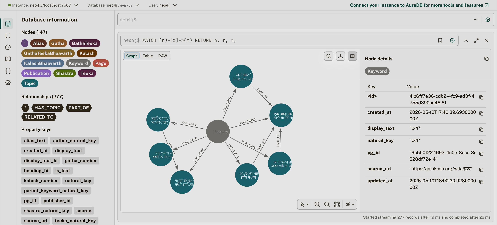
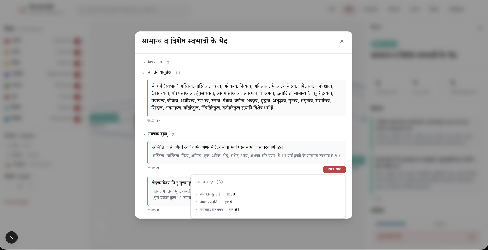
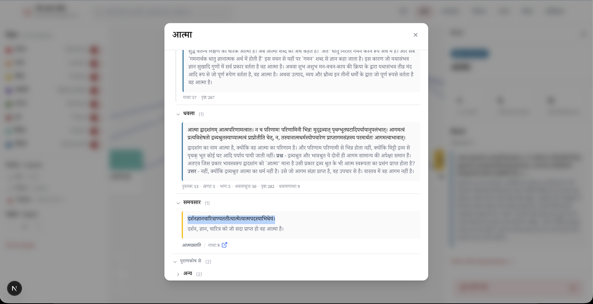
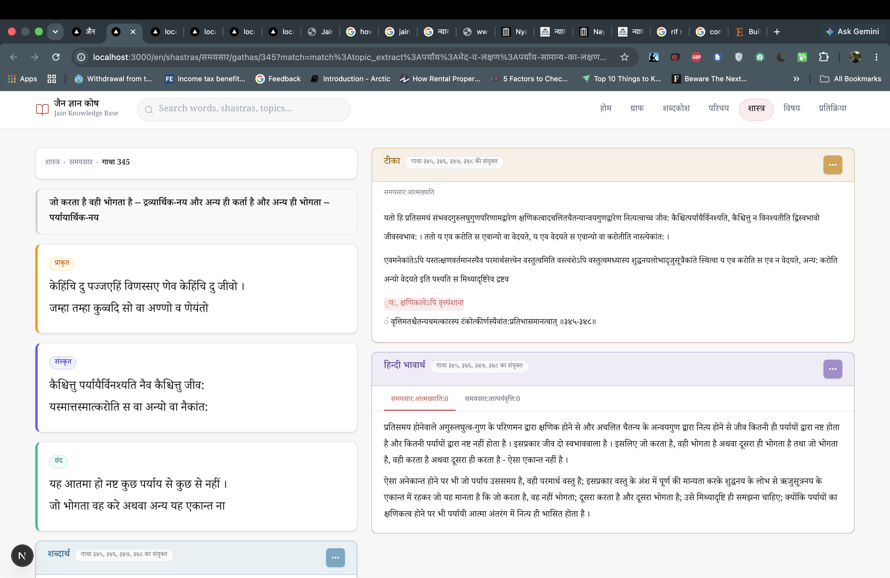
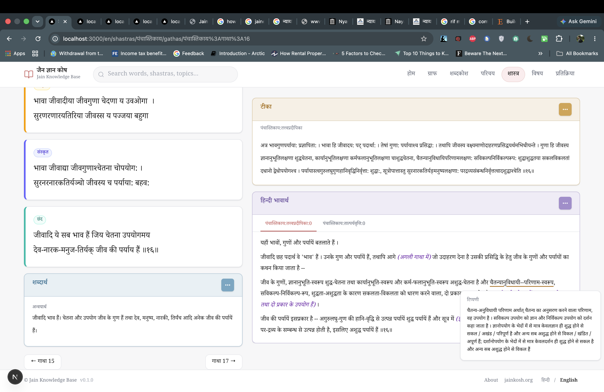
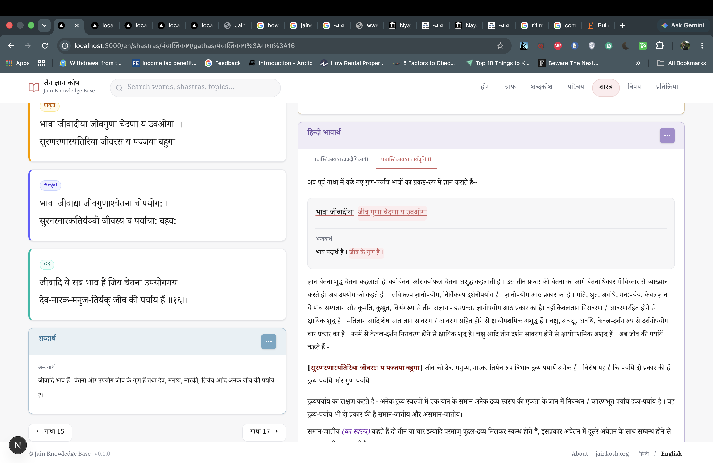

# Jain Knowledge Base Service

A structured, knowledge-graph-backed retrieval layer for Jain texts.

Features -
- Knowledge Base Graph for Jainism. (Keywords/Topics/Shastras/Gathas etc.)
- Shastra Reader with various AI enhancements.
- Complements `cataloguesearch` (vector/BM25) and `cataloguesearch-chat` (LLM chat) for GraphRAG.

## Usecases/Objectives

- **Structured (knowledge retented) search engine** for Jain Texts expanded/enhanced on top of `JainKosh` authored by - _Kshullak Jinendra Varni Ji_ and the works done by scholars for creating its digital infrastructure at [jainkosh.org](https://jainkosh.org) by linking keywords with definitions/topics/shastras/references. Also, uses various shastras' parsed/OCRed data fed systematically and categorically from various sources ([nikkyjain.github.io](https://nikkyjain.github.io), [swalakshya](https://swalakshya.me)).

- **Graph traversal** of Jain Knowledge Base in an interactive UI.

<p float="left">
  
  
</p>

- A digital preservation initiative for Jain Shastras including a **Shastra Reader** with various AI enhancements.

<p float="left">
  
  
</p>
<p float="left">
  
  
</p>

Enhancing `cataloguesearch-chat` with - 
- **Finding exact** sanskrit/prakrit/hindi gatha from shastras and understanding it word to word.

- Acts as a **cache and pre-querying dictionary** layer (finding exact keywords) to the existing vector search at cataloguesearch.

- **In depth answer generation** of questions on cataloguesearch-chat

- Structured or metadata based questions (like questions related on a specific gatha, adhyaya, specific topic mentions, translations of gatha verses etc.) For ex -
  - समयसार की गाथा ६ बताओ
  - समयसार की 6th गाथा का भावार्थ बताओ
  - समयसार की गाथा ६ की संस्कृत समझाओ
  - समयसार की 6th गाथा में किन किन विषयों का वर्णन आया है?
  - द्रव्य की स्वतंत्रता का वर्णन कोन कोनसे शास्त्रों में आया है?

[_Current vector search only extracts excerpts of gatha mentions in texts but does not have context of the gatha itself, what does it explain at an high level etc. This will extract high-level content and specific topics which are relevant to it, feed it to chat service, and then final answer generation will utilize both vectored RAG and vectorless/graphRAG results._]

Future -
- **Train a Jainism based AI model** in future with the help of Cataloguesearch OCRed data and this Knowledge Graph for the most accurate results.

## What this service does

- **Master Metadata** — authors, shastras, teekas, books, pravachans, anuyogas stored in PostgreSQL with stable UUIDs.
- **Dictionary** — gathas, kalashas (Prakrit/Sanskrit/Hindi), keyword definitions, topic extracts stored in MongoDB (long-form text) with index rows in PostgreSQL.
- **Knowledge Graph** — `keyword↔topic↔topic↔gathas↔teekas↔shastras↔pages` all kind of relations in Neo4j, enabling GraphRAG retrieval.
- **Matching Engine** — resolves JainKosh extract blocks to exact NJ shastra spans, stores offsets in Mongo `extract_matches`, and powers "View in Shastra" deep-links plus reading-page highlights.
- **Ingestion pipeline** — scrapers for JainKosh and nikkyjain.github.io; an enrichment loop that pulls topic candidates from `cataloguesearch-chat`.
- **Admin + Public APIs** — FastAPI services for curating content and serving the public UI.

## Architecture

> See [`docs/design/00_overview.md`](docs/design/inital_design/00_overview.md) for the full design reading order.

### Services

Two FastAPI apps: one consolidated core app plus an independent query app:

| Service | Port | Role | Reads | Writes |
|---|---|---|---|---|
| `core-service` | 8001 | Metadata + data + navigation APIs: CRUD, browse/search, graph traversal/admin | Postgres + Mongo + Neo4j | Postgres + Mongo + Neo4j |
| `query-service` | 8004 | GraphRAG endpoint for `cataloguesearch-chat`: tokenize → resolve → graph-traverse → rank | Postgres + Mongo + Neo4j | Postgres (query_logs) |

### Matching Engine Surface

The matching engine spans three implementation areas:

- `workers/matching/` runs the extract-to-target resolution and writes Mongo `extract_matches`
- `services/core_service/` hydrates `match_natural_keys` into keyword/topic payloads and serves `GET /v1/extract-matches/{natural_key}`
- `ui/` uses those rows to render "View in Shastra" links and `?match=`-driven highlights on the reading page

Primary docs:

- [Matching Engine Wiki](docs/design/matching_engine/README.md)
- [API Docs Index](docs/design/api/README.md)
- [UI Developer Wiki](ui/README.md)

### Data Stores

| Store | Engine | Use |
|---|---|---|
| Relational | **PostgreSQL 16** | Source of truth for all IDs; metadata, keyword/topic/gatha/kalasha index rows, ingestion runs, review queue, audit logs |
| Document | **MongoDB 7** | Long-form text: gathas, teeka commentary, keyword definitions, topic extracts, raw HTML snapshots, kalash content, future OCR pages |
| Graph | **Neo4j 5 Community** | Keyword & topic nodes + typed edges (`IS_A`, `PART_OF`, `RELATED_TO`, `ALIAS_OF`, `HAS_TOPIC`, `MENTIONS_KEYWORD`, `MENTIONS_TOPIC`, `IN_SHASTRA`, `IN_TEEKA`, `IN_PUBLICATION`, `CONTAINS_DEFINITION`). Graph traversal (`landing` / `expand` / `preview`) traverses `IS_A|PART_OF|RELATED_TO|HAS_TOPIC|MENTIONS_KEYWORD|MENTIONS_TOPIC|CONTAINS_DEFINITION|IN_SHASTRA` across labels `Topic, Keyword, Shastra, Gatha, GathaTeeka, GathaTeekaBhaavarth, Kalash, KalashBhaavarth, Page` (each label maps to its own `EntityKind` in the UI — `gatha`, `teeka`, `bhaavarth` (shared by GathaTeekaBhaavarth + KalashBhaavarth), `kalash`, `page` — with its own filter swatch, colour, and icon). `exclude_stubs` defaults to `false`, so JainKosh-seeded stubs are visible until NJ ingestion fills them in. |
| Queue/cache | **Redis 7** | Celery broker, rate-limit buckets for scrapers, ephemeral parse-job state |

Postgres is the **source of truth for IDs**. Every entity in Mongo or Neo4j has a `natural_key` and a UUID issued by Postgres. The Neo4j graph mirrors Postgres — a full rebuild from Postgres + Mongo is always possible and safe.

### Tech Stack

- **Language**: Python 3.12, `.venv` virtualenv
- **Web**: FastAPI + Uvicorn, Pydantic v2
- **ORM**: SQLAlchemy 2 (async) + Alembic migrations
- **Mongo client**: Motor (async)
- **Neo4j client**: official `neo4j` driver (async)
- **Job queue**: Celery + Redis
- **Scraping**: `httpx` + `selectolax` (HTML), `trafilatura` fallback
- **Frontend**: Next.js 16 (App Router) + Tailwind 4 + `next-intl` (Hindi-first, Devanagari-forward); see [`ui/README.md`](ui/README.md)
- **Deploy**: Docker Compose on a single VM

### Data Sources

| Source | Format | Frequency | Output |
|---|---|---|---|
| `jainkosh.org/wiki/Category:<letter>` | Live HTML (MediaWiki) | Manual trigger, batched per-letter | Keywords, definitions, initial topics |
| `nikkyjain.github.io` | Static HTML per shastra | Manual trigger, per shastra | Shastra metadata, gathas (Prakrit/Sanskrit/Hindi), word-meaning maps — **implemented** in `workers/ingestion/nj/` (see `docs/wiki/nj_parser.md`, `docs/wiki/nj_ingestion.md`) |
| `samples/vyakaran_vishleshan/<shastra>/*.png` | PNG scans | Future, manual | Word-by-word breakdowns per gatha |
| `cataloguesearch-chat` candidate topics DB | Read-only pull (cron) | Daily | `topic_candidates` rows for admin review |

### High-Level Data Flow

```
                    ┌─────────────────┐
                    │  Admin UI       │
                    │ (Next.js)       │
                    └──────┬──────────┘
                           │ trigger ingest, review queues, curate graph
                           ▼
┌─────────┐ scrape  ┌──────────────────────────────────────┐
│jainkosh │◄────────│  ingestion workers (Celery)          │
└─────────┘         │  - jainkosh parser + apply           │
┌─────────┐ scrape  │  - gatha parser (nj/cataloguesearch) │
│nj(local)│◄────────│  - vyakaran OCR (future)             │
│ CS OCRs │         │                                      │
│         │         │  enrichment workers (Celery)         │
│         │         │                                      │
└─────────┘         └────┬──────────┬──────────┬───────────┘
                         ▼          ▼          ▼
                   ┌─────────┐ ┌────────┐ ┌─────────┐
                   │Postgres │ │ Mongo  │ │ Neo4j   │
                   └────┬────┘ └───┬────┘ └────┬────┘
                        │          │           │
                   ┌───────────────────────────────┐
                   │  core-service                 │
                   │  (port 8001)                  │
                   └───────┬───────────────┬───────┘
                           │               │         
                           ▼               ▼
                        Public UI    query_svc --> cataloguesearch_chat
```

### Implementation Status

See [`IMPLEMENTATION_NOTES.md`](IMPLEMENTATION_NOTES.md) for full details on each completed component.

| Component | Status |
|---|---|
| Postgres data model + Alembic migrations (17 versions) | ✅ |
| MongoDB data model (16 collections, Motor async) | ✅ |
| Neo4j graph data model (constraints, upserts, queries) | ✅ |
| JainKosh HTML parser (`workers/ingestion/jainkosh/`) | ✅ |
| Phase 1 ingestion apply layer (`apply_approved_keyword_payload`) | ✅ |
| Core Service API (port 8001, merged metadata+data+navigation) | ✅ |
| Query Service API (port 8004, GraphRAG — 6 phases, 91 tests) | ✅ |
| NikkYJain ingestion pipeline (`workers/ingestion/nj/`, 72 tests) | ✅ |
| Matching engine (`workers/matching/` + `extract_matches` API + UI deep-links/highlights) | ✅ |
| Ingestion workers (vyakaran OCR) | 🔜 |
| Public UI — Next.js 16 (8 phases: shells, graph, content pages, a11y) | ✅ |
| Deployment (Docker Compose) | 🔜 |


### JainKosh Parser —

The JainKosh HTML parser (`workers/ingestion/jainkosh/`) converts raw MediaWiki HTML into a `WouldWriteEnvelope` — a structured preview of exactly what each store (Postgres / Mongo / Neo4j) would receive on admin approval.

Results on sample keyword pages:

#### Summary
| Page   | SK defs | PK defs | Idx rels | Subsections | Keywords (int+ext) | Topics (int+ext) | Nodes | Edges | Refs (Res) | Warnings |
| ------ | ------- | ------- | -------- | ----------- | ------------------ | ---------------- | ----- | ----- | ---------- | -------- |
| आत्मा  | 4       | 2       | 0        | 7           | 2                  | 9                | 11    | 30    | 15         | 0        |
| द्रव्य | 1       | 1       | 26       | 59          | 9                  | 105              | 114   | 224   | 164        | 0        |
| पर्याय | 1       | 2       | 8        | 43          | 3                  | 56               | 59    | 152   | 114        | 0        |

#### Nodes
| Page   | Keyword (int) | Keyword (ext) | Topic (int) | Topic (ext) | Gatha (lazy) | GathaTeeka (lazy) | GathaTeekaBhaavarth (lazy) | Page (lazy) |
| ------ | ------------- | ------------- | ----------- | ----------- | ------------ | ----------------- | -------------------------- | ----------- |
| आत्मा  | 1             | 1             | 7           | 2           | 8            | 2                 | 0                          | 5           |
| द्रव्य | 1             | 8             | 85          | 20          | 30           | 16                | 10                         | 26          |
| पर्याय | 1             | 2             | 51          | 5           | 9            | 19                | 9                          | 20          |

#### Edges
| Page   | CONTAINS_DEFINITION | HAS_TOPIC | MENTIONS_TOPIC | PART_OF | RELATED_TO |
| ------ | ------------------- | --------- | -------------- | ------- | ---------- |
| आत्मा  | 7                   | 3         | 13             | 4       | 3          |
| द्रव्य | 0                   | 5         | 103            | 80      | 36         |
| पर्याय | 0                   | 3         | 93             | 48      | 8          |

To regenerate from latest goldens, run: `python scripts/golden_stats.py`

---
## Local setup

### Prerequisites
- Python 3.12
- PostgreSQL 16 (`brew install postgresql@16`)
- MongoDB 7 (`brew install mongodb-community@7.0`)
- Neo4j 5+ (`brew install neo4j`)
- `.venv` already created at repo root

### Install

```bash
# Activate venv
source .venv/bin/activate

# Install jain_kb_common + deps (SQLAlchemy, asyncpg, Pydantic, Motor, neo4j, pyyaml)
pip install -e packages/jain_kb_common

# Start services
brew services start postgresql@16
brew services start mongodb-community@7.0

# Neo4j needs a one-time password setup before first start
/opt/homebrew/opt/neo4j/bin/neo4j-admin dbms set-initial-password jainkb_password
/opt/homebrew/opt/neo4j/bin/neo4j start   # runs as foreground process; use brew services for background

# Create Postgres databases
psql postgres -c "CREATE DATABASE jain_kb_dev;"    # migrations / manual testing
psql postgres -c "CREATE DATABASE jain_kb_test;"   # automated tests
# MongoDB and Neo4j databases are created automatically on first write
```

### Run migrations (Postgres)

```bash
export DATABASE_URL="postgresql+asyncpg://$(whoami)@localhost/jain_kb_dev"
alembic upgrade head
```

### Run tests

All tests now live under `tests/`. Tightly-correlated suites:

| Suite | Path | Why grouped |
|---|---|---|
| **DB layer** | `tests/db/` | Raw Postgres / Mongo / Neo4j upsert tests |
| **Ingestion apply** | `tests/ingestion/` | Integration tests for `apply_approved_keyword_payload` |
| **metadata + data services** | `tests/services/metadata/` + `tests/services/data/` | Both use the same Postgres schema; data entities FK-depend on metadata entities |
| **navigation + query services** | `tests/services/navigation/` + `tests/services/query/` | Both mock Neo4j and share the same Postgres schema |
| **Core + query services together** | `tests/services/` | Run as one suite to catch cross-service regressions |
| **Workers / parsers** | `tests/workers/` | Ingestion pipeline unit tests — no DB required |
| **Common library** | `tests/common/` | `jain_kb_common` hydration unit tests — no DB required |

```bash
# DB layer tests
export DATABASE_URL="postgresql+asyncpg://$(whoami)@localhost/jain_kb_test"
export MONGO_URL="mongodb://localhost:27017"
export NEO4J_URL="bolt://localhost:7687"
export NEO4J_USER="neo4j"
export NEO4J_PASSWORD="jainkb_password"
python -m pytest tests/db/ -v

# Ingestion apply tests
export DATABASE_URL="postgresql+asyncpg://$(whoami)@localhost/jain_kb_test"
python -m pytest tests/ingestion/ -v

# Core + query services (run together)
export DATABASE_URL="postgresql+asyncpg://$(whoami)@localhost/jain_kb_test"
export NEO4J_PASSWORD=jainkb_password
python -m pytest tests/services/ -v

# Metadata service only (no Mongo/Neo4j required)
export DATABASE_URL="postgresql+asyncpg://$(whoami)@localhost/jain_kb_test"
python -m pytest tests/services/metadata/ -v

# Data service only (Mongo mocked, no real Mongo required)
export DATABASE_URL="postgresql+asyncpg://$(whoami)@localhost/jain_kb_test"
python -m pytest tests/services/data/ -v

# Navigation service only (Neo4j mocked, no real Neo4j required)
export DATABASE_URL="postgresql+asyncpg://$(whoami)@localhost/jain_kb_test"
export NEO4J_PASSWORD=jainkb_password
python -m pytest tests/services/navigation/ -v

# Query service only (Neo4j + Mongo mocked; Postgres real)
export DATABASE_URL="postgresql+asyncpg://$(whoami)@localhost/jain_kb_test"
python -m pytest tests/services/query/ -v

# Parser / worker unit tests (no DB required)
python -m pytest tests/workers/ -v

# NJ integration tests require the local nikkyjain repo clone
export NIKKYJAIN_LOCAL_PATH="/path/to/nikkyjain.github.io"
python -m pytest tests/workers/nj/ -v

# Hydration unit tests (no DB required)
python -m pytest tests/common/ -v

# Full suite — 1202 passed, 1 skipped, 0 failed (as of 2026-06-13)
# Requires: Postgres + Neo4j running; nikkyjain repo cloned locally
export DATABASE_URL="postgresql+asyncpg://$(whoami)@localhost/jain_kb_test"
export MONGO_URL="mongodb://localhost:27017"
export NEO4J_URL="bolt://localhost:7687"
export NEO4J_USER="neo4j"
export NEO4J_PASSWORD="jainkb_password"
export NIKKYJAIN_LOCAL_PATH="/path/to/nikkyjain.github.io"
python -m pytest tests/ -v

# UI tests — 491 passed, 0 failed (as of 2026-06-13)
cd ui && npm test
```

---

## Scripts

All scripts live under `scripts/` and expect the standard env vars (`DATABASE_URL`, `NEO4J_URL`, `NEO4J_PASSWORD`, `MONGO_URL`, `MONGO_DB_NAME`) to be exported before running.

### `clear_dbs.py` — wipe all ingestion databases

Truncates every Postgres table (cascading), drops all Mongo collections written by any ingestor, and deletes all Neo4j nodes. Use this before a fresh re-ingest.

```bash
export DATABASE_URL="postgresql+asyncpg://$(whoami)@localhost/jain_kb_dev"
export MONGO_URL="mongodb://localhost:27017"
export MONGO_DB_NAME="jain_kb"
export NEO4J_URL="bolt://localhost:7687"
export NEO4J_USER="neo4j"
export NEO4J_PASSWORD="jainkb_password"

python scripts/clear_dbs.py
# optional: target a non-default Neo4j database
python scripts/clear_dbs.py --neo4j-database neo4j
```

Mongo collections cleared: `keyword_definitions`, `topic_extracts`, `raw_html_snapshots`, `tables` (JainKosh) + `gatha_hindi_chhand`, `gatha_prakrit`, `gatha_sanskrit`, `gatha_teeka_bhaavarth_hindi`, `gatha_teeka_sanskrit`, `kalash_hindi`, `kalash_sanskrit`, `kalash_word_meanings`, `teeka_gatha_mapping` (NJ).

### `ingest_goldens_apply.py` — apply JainKosh golden envelopes

Parses and applies the bundled golden keyword fixtures (आत्मा, द्रव्य, पर्याय, वस्तु) to Postgres + Mongo + Neo4j. Useful for smoke-testing the full ingestion stack against real data.

```bash
# apply all four goldens
python scripts/ingest_goldens_apply.py

# apply a single keyword
python scripts/ingest_goldens_apply.py --keyword आत्मा

# dry-run: summarise what would be written, no DB writes
python scripts/ingest_goldens_apply.py --dry-run

# stamp all Mongo docs with a specific ingestion run UUID
python scripts/ingest_goldens_apply.py --ingestion-run-id <uuid>
```

To start fresh: run `clear_dbs.py` first, then this script.

### `ingest_nj_apply.py` — apply a NikkYJain shastra

Parses a NJ shastra config and applies the resulting envelope (gathas, kalashas, teeka content) to Postgres + Mongo + Neo4j.

```bash
# apply a full shastra (NJ_CONFIG env var or --config flag)
export NJ_CONFIG="samaysar"
python scripts/ingest_nj_apply.py

python scripts/ingest_nj_apply.py --config parser_configs/nj/samaysar.yaml

# apply only a single gatha
python scripts/ingest_nj_apply.py --config parser_configs/nj/samaysar.yaml --gatha 001

# dry-run: print gatha/kalash counts, no DB writes
python scripts/ingest_nj_apply.py --config parser_configs/nj/samaysar.yaml --dry-run

# stamp Mongo docs with a specific ingestion run UUID
python scripts/ingest_nj_apply.py --config parser_configs/nj/samaysar.yaml --ingestion-run-id <uuid>
```

To start fresh: run `clear_dbs.py` first, then this script.

### `golden_stats.py` — regenerate JainKosh parser summary table

Regenerates the node/edge summary table shown in the JainKosh Parser section above.

```bash
python scripts/golden_stats.py
```

---

## Repository layout

```
dictionary-and-metadata-service/
├── docs/
│   ├── design/                # Full design docs (00–16)
│   └── manual_testing/
│       ├── postgres/testing.md
│       ├── mongo/testing.md
│       ├── neo4j/testing.md
│       └── api/
│           ├── metadata/testing.md
│           ├── data/testing.md
│           ├── navigation/testing.md
│           └── query/          # keyword_resolve_batch, topics_match, graphrag, topics_in_shastra, shastras_for_topic
├── parser_configs/
│   └── _meta/
│       └── edge_types.yaml    # Canonical Neo4j edge type registry
├── packages/
│   └── jain_kb_common/        # Shared DB clients, models, upserts, hydration helpers
│       └── jain_kb_common/
│           ├── db/
│           │   ├── postgres/  # SQLAlchemy models + upserts (incl. publications.py, kalashas.py)
│           │   ├── mongo/     # Motor client, Pydantic schemas, upserts, indexes (16 collections)
│           │   └── neo4j/     # AsyncDriver factory, constraints, upserts, queries, schema_check
│           └── hydration/     # hydrate_definitions_hi, hydrate_topic_extracts_hi, extract_references
├── migrations/                # Alembic (17 versions, 0001–0017 incl. trgm indexes for query engine)
├── tests/                         # All tests — single root test suite
│   ├── db/
│   │   ├── postgres/test_idempotent_upsert.py   # Postgres upsert tests
│   │   ├── mongo/test_mongo_upsert.py            # MongoDB schema + upsert tests
│   │   └── neo4j/test_neo4j_graph.py             # Neo4j constraints, upserts, queries
│   ├── ingestion/
│   │   └── test_apply.py               # apply_approved_keyword_payload integration tests
│   ├── scripts/                        # Ingest env + golden apply smoke tests
│   ├── common/
│   │   └── hydration/test_hydration.py # jain_kb_common hydration unit tests (no DB)
│   ├── services/                       # All four FastAPI services (share Postgres schema — run together)
│   │   ├── metadata/                   # 7 test files — authors, shastras, teekas, publications, books, pravachans, fuzzy
│   │   ├── data/                       # 8 test files — keywords, gathas, topics, kalashas, browse, search
│   │   ├── navigation/                 # 7 test files — aliases, edges, neighbors, resolution, graph payload, landing
│   │   └── query/                      # 14 test files — resolve_batch, graphrag, topics_match, topics_in_shastra, shastras_for_topic
│   └── workers/
│       ├── jainkosh/                   # Golden test + 30 unit tests; fixtures/ symlinked from workers/ingestion/jainkosh/tests/
│       └── nj/                         # 9 nj parser unit tests
├── services/
│   ├── core_service/          # FastAPI core service (port 8001) — metadata + data + navigation domains
│   └── query_service/         # FastAPI query service (port 8004) — GraphRAG: keyword resolve, topics match, graphrag, subworkflow endpoints
├── workers/
│   └── ingestion/
│       ├── jainkosh/
│       │   ├── apply.py               # apply_approved_keyword_payload
│       │   └── tests/fixtures/        # HTML fixtures (symlinked into tests/workers/jainkosh/fixtures/)
│       └── nj/                        # NikkYJain shastra ingestion pipeline
│           ├── orchestrator.py        # parse loop + global kalash counter
│           ├── parse_myitem.py        # regex-parse myItem.js → GathaIndexEntry maps
│           ├── classify_pages.py      # primary_gatha | secondary_kalash | skip
│           ├── parse_page.py          # per-file HTML parse + multi-gatha expansion
│           ├── parse_primary_teeka.py # structural kalash + bhaavarth extraction
│           ├── parse_secondary_teeka.py
│           ├── html_to_markdown.py    # HTML → Markdown (bhaavarth)
│           ├── models.py              # Pydantic extract models
│           ├── config.py              # YAML config loader
│           ├── envelope.py            # build_envelope() — golden payload
│           ├── apply.py               # apply_nj_shastra_payload()
│           └── cli.py                 # python -m workers.ingestion.nj.cli parse
├── ui/                        # Next.js 16 public UI — see docs/ui/README.md
├── parser_configs/            # YAML/JSON scraper rules
├── samples/
│   ├── sample_html_granths_nj/    # Sample nikkyjain HTML for parser development
│   ├── sample_html_jainkosh_pages/# Sample JainKosh HTML for parser development
│   └── vyakaran_vishleshan/       # Scanned images for future OCR
├── alembic.ini
└── pyproject.toml
```
